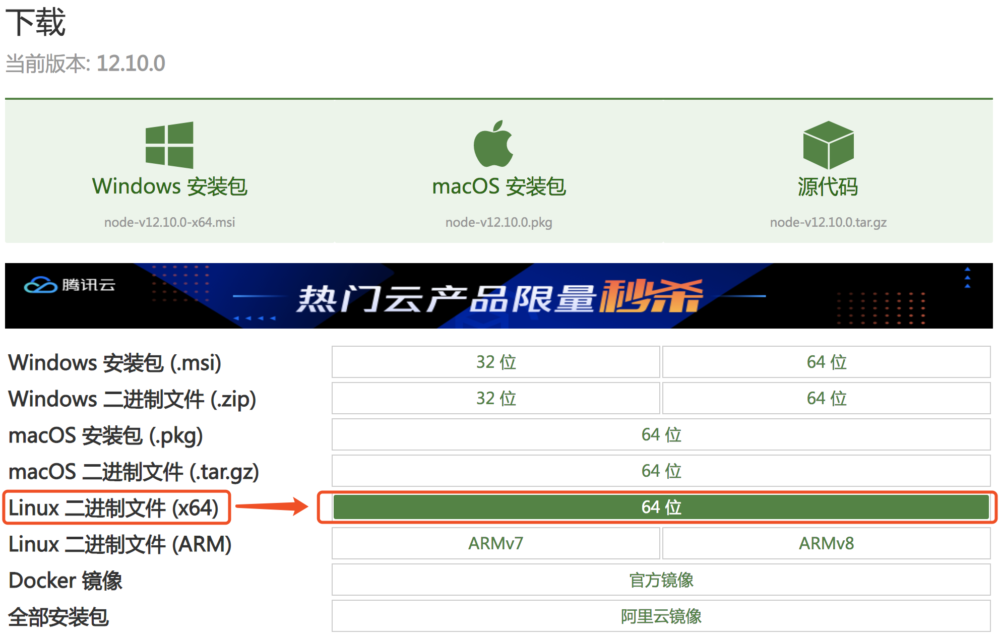
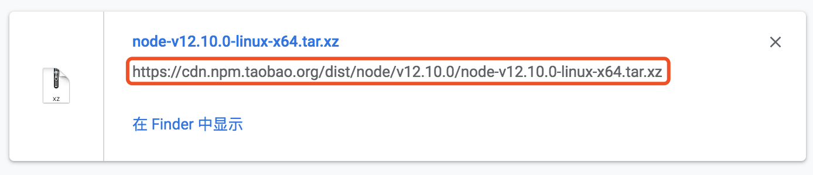

<h1 > vueServer </h1>

> 基于VUE框架的前端模版

<h2 > 服务部署环境nodejs安装 </h2>

[nodejs官网下载页](http://nodejs.cn/download/)

1.点击链接进入界面如下图：


2.可以下载到本地再上传到服务器，或者复制如下图中的链接，使用wget指令直接下载


```bash
# 1.使用wget指令下载对应压缩包
wget https://cdn.npm.taobao.org/dist/node/v12.10.0/node-v12.10.0-linux-x64.tar.xz

# 2.解压压缩包
tar -xvf node-v12.10.0-linux-x64.tar.xz

# 3.设置软连接 方便使用node、npm命令
ln -s /你设置的nodejs安装路径/nodejs/bin/npm   /usr/local/bin/ 
ln -s /你设置的nodejs安装路径/nodejs/bin/node   /usr/local/bin/

# 4.执行node -v和npm -v查看版本
#   如果显示如下则说明nodejs环境安装完成
$ node -v
v10.16.3
$ npm -v
6.9.0
```


<h2 > 启动服务的步骤 </h2>

``` bash
# 在项目根目录下执行下面操作
# 安装依赖
npm install

# 启动服务
npm run dev
```

